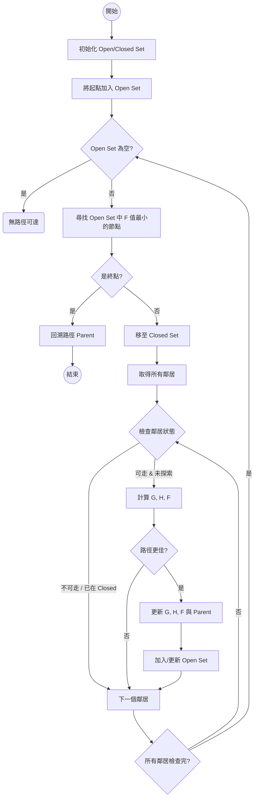

# Unity A* 尋路演算法 (A* Pathfinding Algorithm)

這是一個在 Unity 引擎中實作 **A* (A-Star)** 尋路演算法的開源範例專案。此專案展示了如何在網格系統中計算從起點到終點的最短路徑，並透過 Gizmos 進行視覺化除錯。

## 🚀 專案功能 (Features)

- **核心尋路演算法**: 完整實作 A* 演算法邏輯，計算 `F = G + H` 代價。
- **動態網格系統 (Grid System)**: 自動生成可導航的網格地圖。
- **障礙物偵測**: 節點 (Node) 包含可行走與不可行走的屬性設定。
- **視覺化除錯 (Visualization)**: 使用 Unity Gizmos 在編輯器中繪製網格、路徑與節點狀態（`Open List`, `Closed List`）。

## 🧠 A* 演算法詳細流程 (Algorithm Deep Dive)

A* 是一種啟發式搜尋演算法，結合了 Dijkstra 演算法（考量起點距離）與 最佳優先搜尋 (Best-First Search，考量終點距離）的優點。

### 📊 邏輯流程圖 (Logic Flowchart)



### 核心計算公式
$$F = G + H$$

- **G Cost (Path Cost)**: 從**起點**到當前節點的實際移動代價。
- **H Cost (Heuristic)**: 從當前節點到**終點**的估計移動代價。
- **F Cost**: 總評價分數。A* 每次都會優先探索 F 值最小的節點。

### 📐 移動代價示意 (Movement Cost)

為了節省浮點數運算，我們通常將標準單位 1 放大為 10：
- **水平/垂直移動**: 代價 = 10
- **對角線移動**: 代價 = 14 ($\approx 10 \times \sqrt{2} \approx 14.14$)

```text
+------+------+------+
|  14  |  10  |  14  |
+------+------+------+
|  10  |  S   |  10  |
+------+------+------+
|  14  |  10  |  14  |
+------+------+------+
   S = 當前節點 (Source)
```

### 執行步驟
1. **初始化**:
   - 建立兩個集合：`Open Set` (待探索節點) 與 `Closed Set` (已探索節點)。
   - 將起點加入 `Open Set`。
2. **循環搜尋**:
   - 在 `Open Set` 中尋找 **F 值最低**的節點，將其作為「當前節點」。
   - 將「當前節點」從 `Open Set` 移至 `Closed Set`。
   - **終點偵測**: 如果「當前節點」就是終點，則搜尋結束，開始回溯路徑。
   - **探索鄰居**: 對於「當前節點」的每一個鄰居：
     - 如果鄰居不可行走或已在 `Closed Set` 中，忽略它。
     - 如果新路徑到鄰居的 G Cost 較短，或者鄰居不在 `Open Set` 中：
       - 更新鄰居的 G, H, F Cost。
       - 將鄰居的 `Parent` 設為「當前節點」。
       - 如果鄰居不在 `Open Set` 中，將其加入。
3. **路徑回溯**:
   - 從終點開始，沿著 `Parent` 指針一路追蹤回起點，即得到最終最短路徑。

## 📂 檔案結構 (File Structure)

主要腳本位於 `Assets/Script/` 目錄下：

- **`FindPath.cs`**: 尋路系統的核心管理器，負責執行 A* 運算並回傳路徑。
- **`Grid.cs`**: 負責建立地圖網格，將世界座標轉換為網格座標，並管理所有節點。
- **`Node.cs`**: 定義單個節點的資料結構（包含世界座標、G/H/F 代價、父節點參照等）。
- **`LearnGizmos.cs`**: 用於測試與學習 Unity Gizmos 繪圖功能的輔助腳本。

## 🎮 如何使用 (Getting Started)

### 環境需求
- Unity Editor (建議使用 2019.4 LTS 或更新版本)

### 執行步驟
1. 下載或 Clone 此專案。
2. 使用 Unity Hub 開啟專案資料夾 (`unity-AStarAlgorithm/AStar`).
3. 在 Project 視窗中，導航至 `Assets/Scenes/`。
4. 雙擊開啟 **`AStar.unity`** 場景。
5. 點擊 Unity 編輯器上方的 **Play** ▶️ 按鈕。
6. 您應該能在 Scene 視窗或 Game 視窗中看到路徑生成的結果（需開啟 Gizmos 顯示）。

## 🛠️ 實作細節

A* 演算法透過以下公式評估每個節點：
$$F = G + H$$

- **G Cost**: 從起點移動到當前節點的距離代價。
- **H Cost (Heuristic)**: 從當前節點到終點的預估距離（通常使用曼哈頓距離或歐基里德距離）。
- **F Cost**: 總代價，路徑選擇時優先考慮 F 值最低的節點。

## 📝 License

此專案採用 MIT License。